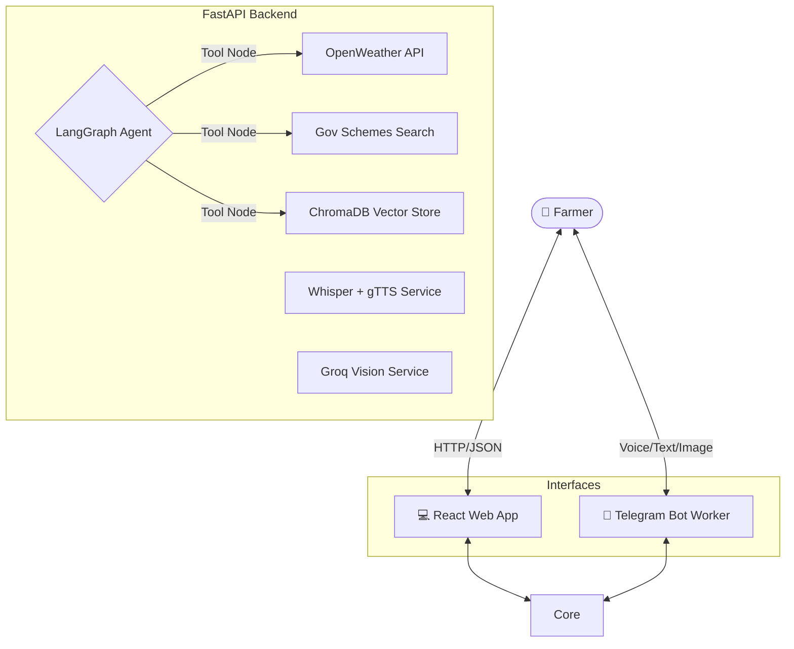

  
# 🌱 Kisan AI Advisor (Agri-Bot System)

**An Enterprise-Grade, Autonomous AI Advisory Platform for Indian Agriculture**

*Leveraging state-of-the-art LLMs, Vision models, and RAG to democratize agricultural intelligence.*

---

## 🚀 Overview

The **Agri-Bot System** is a next-generation AI platform designed to provide Indian farmers with hyper-local, multilingual, and scientifically accurate farming advice. 

Traditional agricultural advisory systems rely on slow manual intervention. This platform utilizes **LangGraph-driven autonomous agents** and **Retrieval-Augmented Generation (RAG)** to instantly diagnose crop diseases, recommend safe chemical treatments, and provide live weather forecasting—all delivered seamlessly through a beautiful web interface or a Telegram Bot.

---

## ✨ Core AI Capabilities

### 🧠 Agentic Routing (LangGraph)
Powered by a `llama3-70b` model, the system uses LangGraph to autonomously route user queries to the correct specialized tools (Weather API, Scheme Search, or Vector Database) rather than relying on brittle rule-based logic.

### 🛡️ Hallucination-Free Recommendations (RAG)
To prevent the AI from hallucinating dangerous chemical treatments, the system is backed by a **ChromaDB Vector Store** populated with official agricultural safety manuals. The AI is strictly instructed to query the Vector DB for verified medicine and pesticide recommendations.

### 👁️ Computer Vision Diagnostics
Farmers can upload images of diseased crops. The system routes the image through **Groq Vision**, performing zero-shot disease classification and returning actionable prevention strategies.

### 🗣️ Multilingual Voice Synthesis
Built for accessibility, the system supports voice-first interactions. It transcribes regional Indian dialects using **OpenAI Whisper**, processes the request via the LLM, and synthesizes a localized audio response using **gTTS**.

---

## 🏗️ System Architecture

The platform is built on a decoupled, microservice-oriented architecture to ensure scalability and ease of deployment.

---

## 🛠️ Technology Stack

| Component | Technology | Description |
|-----------|------------|-------------|
| **LLM Orchestration** | LangGraph & LangChain | Manages tool execution and stateful agent conversation. |
| **Inference Engine** | Groq (`llama3-70b`) | Ultra-fast LPU inference for real-time chat and vision. |
| **Vector Database** | ChromaDB | Embeds and retrieves localized agricultural manuals. |
| **Backend Framework** | FastAPI | High-performance asynchronous REST API. |
| **Frontend Framework** | React + Vite | Glassmorphic, highly responsive SPA for desktop and mobile. |
| **Data Persistence** | SQLite | Lightweight storage for maintaining farmer profiles and session state. |

---

## 🌍 Production Deployment

This repository is configured for seamless deployment on modern PaaS infrastructure using Infrastructure-as-Code (IaC).

### 1. Render (Backend & Telegram Proxy)
The backend and telegram proxy are orchestrated via the `render.yaml` blueprint. They run concurrently within a single free-tier Web Service.
- **Environment Variables Required:** `GROQ_API_KEY`, `OPENWEATHER_API_KEY`, `TELEGRAM_TOKEN`
- **Start Command:** Automatically handled by `start.sh`.

### 2. Vercel (Frontend Web App)
The Vite SPA is optimized for Vercel's edge network.
- **Root Directory:** `./frontend`
- **Environment Variables Required:** `VITE_API_URL` (Pointing to the Render backend)

---

  <i>Built to empower the backbone of India. 🇮🇳</i>

